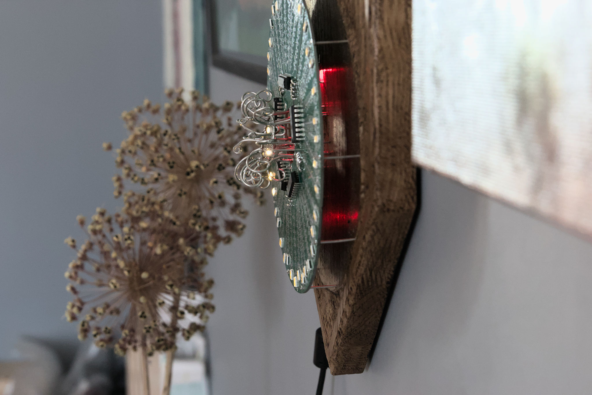
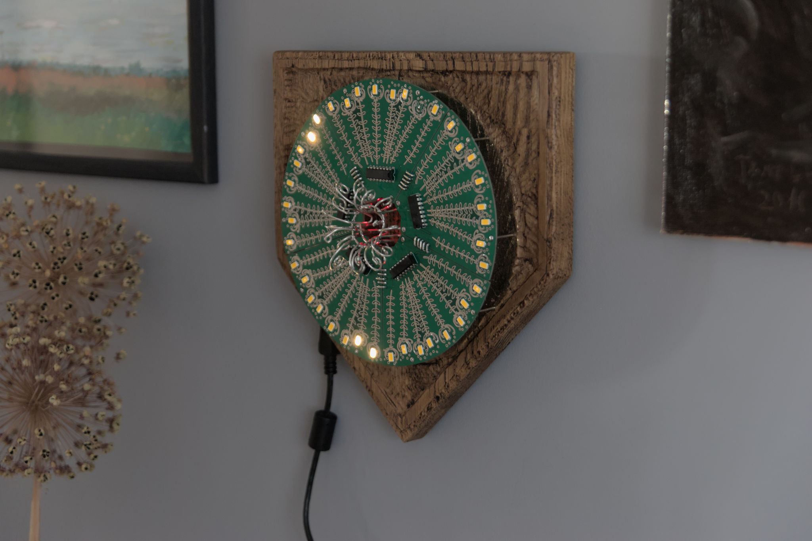

# Lillering

This coat of arms is a circle of flowers (Lillering).

Green PCBs and oak wood are a nice combination.

There is five shift-register to control LEDs.The Arduino’s original shiftOut() function is quite slow. I had to simplify it to make it work with my configuration without noticeable flickering. Board Arduino Pro mini 16Hz Atmega328 5v.

More images on [taunoerik.art](https://taunoerik.art/2022/06/12/lillering/).

